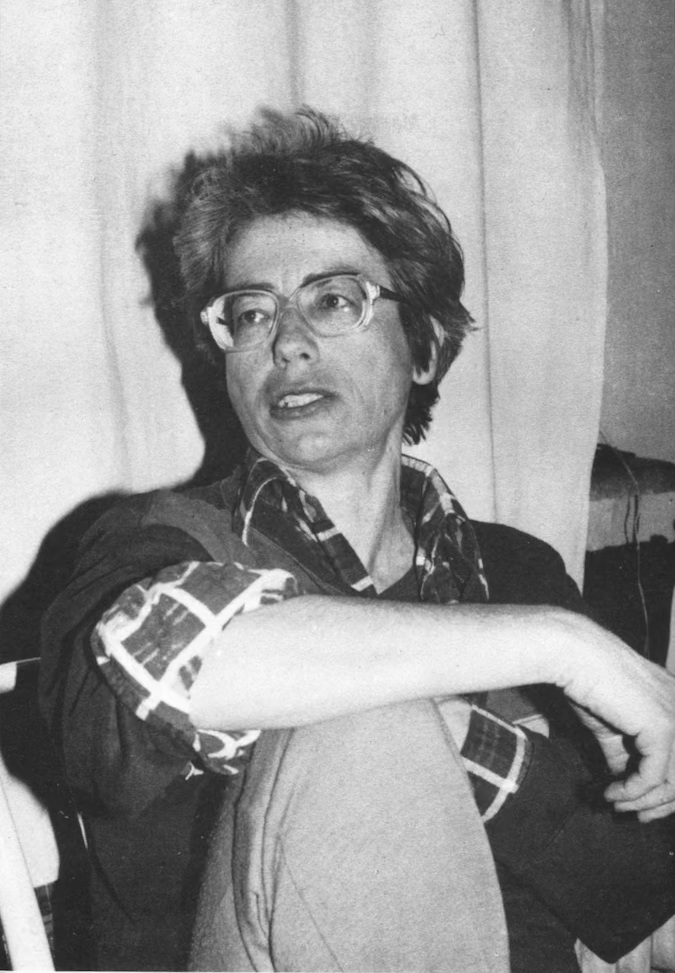

---

## _Marta Pajchel_ ##

### Wiersze wybrane ###

---

nie odchodź ode mnie  
Jeszcze  
już niedługo wiosna  
przecież  
potem lato  
i znów zima  
wytrzymasz*  

Wytrzymać było jednak coraz trudniej. Jej organizm poddawał się nowym słabościom, do postępującej „padasi” dołączyła cukrzyca. A Marta nie była człowiekiem walki, lecz człowiekiem troski: „padasia” to było także stworzenie Boże i nie należało jej zbyt brutalnie leczyć...

Marta czuła potrzebę zapisywania tego co przeżywała od dawna. Pisała w blokach z makulatury i brulionach szkolnych, w bladą fioletową linię lub kratkę, długopisem z kiosku lub ołówkiem z grubsza zatemperowanym. Do tego próbowała rysować, zwykle twarze bliskich i przyjaciół oraz psy: najpierw Żula, a potem Kaję.

Wierszy nie pisała dla literatury, ale dla siebie i przyjaciół, nie z ambicji, ale z potrzeby. Dlatego są one tak autentyczne, tak prawdziwie dokumentują życie Marty i jej bliskich, jej radości i lęki, jej prawdy i wątpliwości. Z drugiej strony zawierają one coś co łączy je z najlepszą literaturą: poszukiwanie Wielkiego Armatora. Ostatniej wiosny przeżywała bardzo poezję ks. Twardowskiego.

Czy należało te wiersze publikować? Zapewne sama Marta niechętnie widziałaby formę starannego tomiku wypełnionego ładniutkimi literkami na bielutkich kartkach. Podejrzewam (a podejrzenie to graniczy z przekonaniem), że rzuciłaby w nas, winnych zamieszania, tym tomikiem. Z drugiej strony, wierszy swoich nie pisała do szuflady, chętnie się z nami nimi dzieliła, pisała o nas i dla nas. Dlatego pozwoliliśmy sobie na ten krok w przekonaniu, że niech już rzuca, ale nam wybaczy, że na podobieństwo jej potrzeby pisania zrozumie naszą potrzebę czytania, przedłużenia tej wspólnej chwili krzątaniną wokół tomiku.

Bo to nie prawda co mówią, że nie ma ludzi niezastąpionych. Bo każdy człowiek jest niezastąpiony, i gdy odchodzi, to po to, żeby zająć swoje miejsce na zawsze.

_Grzegorz Chałasiński_

\*Jadwiga Malina "Wiersze"

---

### Spis treści:  
  
[Dzień dobry Panu...](#dzien_dobry)  
[Tęsknota za kimś jedynym.](#tesknota)  
[PIOTR WIŚNIEWSKI](#PIOTR_WIŚNIEWSKI)  
[Alergiczny nos](#Alergiczny_nos)  
[Ukrócisz moją niepamięć, ukróć pamięć](#Ukrócisz)  
[Żabo zielona ma!](#Żabo)  
[czy ciocia pisze wiersze?](#czy_ciocia)  
[Odwagi z miękkością](#Odwagi)  
[Pozwalają rechotać, i zwierzać się, myśleć](#Pozwalają)  
[Średni pies](#Średni)  
[Zagadki dla matki](#Zagadki)  
[Mamo! posłuchaj!](#Mamo)  
[Rodzinny obiad](#Rodzinny_obiad)  
[Dla Hani i Jasia](#Dla_Hani_i_Jasia)  
[Słyszałam, a nie, wpadło mi w ucho.](#Słyszałam)  
[Żulu, gdzie Twoja buzia](#Żulu_gdzie_Twoja_buzia)  
[… Wszystkich świętych](#Wszystkich_świętych)  
[Żulu, ukochany .](#Żulu_ukochany)  
[Żulu!](#Żulu_Wlazłeś)  
[Żulu mojego serca](#Żulu_mojego_serca)  
[Ptaku Twojego serca](#Ptaku_Twojego_serca)  
[Kaja lizała tyłek](#Kaja_lizała_tyłek)  
[Zimno jak się oparzę w palec](#Zimno)  
[Dawno - mała, nieważna](#Dawno)  
[Jeszcze nie wiem o czym](#Jeszcze)  
[Aura też uciekła](#Aura)  
[Tereny na siebie załażą](#Tereny)  
[Kaja się ruszyła](#Kaja)  
[Czyja twarz wyjrzała?](#Czyja_twarz)  
[,,Nie żyję dłużej od Ciebie](#Nie_żyję_dłużej)  
[Młody człowiek, który badał](#Młody_człowiek)  
[Po lekcji francuskiego](#Po_lekcji_francuskiego)  
[ZGŁUPIALI](#Talent)  
[Sprzeczności](#Sprzeczności)  
[A nie](#A_nie)  
[Hej, Jimmy, słyszysz](#Hej_Jimmy)  
[Walczyki](#Walczyki)  
[Coś błyszczy i lśni](#Coś_błyszczy)  
[Sobie opowiadaj](#Sobie_opowiadaj)  
[Mądry, Miły, tkliwy](#Mądry)  
[Głęboko w siebie,](#Głęboko_w_siebie)  
[Film jest wstrząsający.](#Film)  
[Wybitny poeto,](#Wybitny_poeto)  
[Wy skubane](#Wy_skubane)  
[Wiersz na czterdzieste piąte](#Wiersz_na_czterdzieste_piąte)  
[Wiersz na tytuł profesora](#Wiersz_na_tytuł)  
[Chcę mieć prawo do ,,nie".](#Chcę_mieć_prawo)  
[Wiersz na imieniny Baśki](#Wiersz_na_imieniny)  
[Miej! Miejsce bezpieczne](#Miej)  
[Gadaj, zmywaj, śpij i pierz](#Gadaj)  
[Nie zgnije nić](#Nie_zgnije_nić)  
[Patrzę na](#Patrzę)  
[do siebie :przestań narzekać](#do_siebie)  
[Wiersz Tuwima o dniu](#Wiersz_Tuwima)  
[Wybacz, kupiłam imbryk](#Wybacz)  

---

  
1. Dzień dobry Panu, mówi Marta Pajchel  
2. Gdzie pan jest?  
3. Jak się nie żyje?  
4. Kiedy się umiera?  
5. Kiedy można do Pana przyjść?  
  
21 09 90  
  
\*wiersz napisany pod wpływem wiadomości o śmierci doktora Disnera

#### [powrót](#toc)

---

Tęsknota za kimś jedynym.  
Napisałeś Piotrek Brak ram \- brak wyjść.  
Rany bierzesz za ramy.  
Czy rozpaczy swoje nie tworzysz sam  
By wyleczyć rany i wiedzieć, gdzie iść?  
  
Jedna z ran przywlekła cię w dziwną rzeczywistość  
Jak dziwną i ciekawą tylko ty wiesz  
Nie chcesz jej opuścić, kłuje, całuje i pieści  
A masz wiele innych ran,  
i ram  
napisz, wyraź je, bo nie mieszczą się w mojej treści.  
  
Chcę pobiegać z tobą po lesie  
Pogadać, ale nie wejść na pole szarości  
Chcę wyjaśnienia, gdzie twoja druga strona  
Gdzie szpara w drzwiach i Ogrom Całości  

#### [powrót](#toc)  
---

PIOTR WIŚNIEWSKI  
  
Piotr W odpowiedział NIE \- TAK  
My w poszukiwaniu odnogi do Ty  
Najstarszy zostanie pokonany wkrótce  
Wtedy ukaże się istotą podzieloną  
Podzieloną na ja \- ty \- my  
Ja zaczyna podawać w wątpliwość ty  
My zaczyna cisnąć w lewy bok ja.  
Ja pozwala odpowiedzieć Ty że Ty  
—–––  
Piotr W odpowiedział NIE \- TAK  
My na drodze do Ty  
Najstarszy pokonany wkrótce  
Jest istotą podzielną na Ja \- my \- oni  
Ja zaczyna poddawać w wątpliwość my.  
My uciska w prawym boku oni.  
Ja potrafię odpowiedzieć Oni że My  
–––––  
Piotr W odpowiedział NIE \- TAK  
Ty toczące się w drodze do Oni.  
Najstarszy jego zwycięstwo wkrótce  
Jest podzielny ja \- ty \- on \- my  
Ja zaczyna wątpić o my, które (pewne wy  
to oni,)  
On potrafi odpowiedzieć Oni że ona.  
  
#### [powrót](#toc)  
---

Alergiczny nos  
  
Już patrzę na niego z boku  
Jak każe wielki poeta  
Tylko pomimo, że z boku  
Ciągle on siedzi na mnie, przylepiony  
  
Śpi ze mną, je ze mną  
Sra lub, jak wolisz, oddaje kał  
Złości się ze mną, mną, mną i mną  
Won, ty cholero, ze mnie, mój wał.  
  
Jak śmiesznie wącha, niewiele czując  
Czasami puchnie i rozpiera łeb.  
Lubi zapach ostry i słony, nienawidzi słodkiego,  
Benzyna i perfumy, wody toaletowe,  
Smrody, zgnilizna, pot...  
Przecież, nosie, wypiorę je.  
  
Zapuszczę ci krople, odetchniesz trochę  
Lepiej wtedy śpię lub nie śpię też.  
Tylko, draniu, nie powoduj bólu gardła,  
bo smarcząc, rozerwę cię.  
  
#### [powrót](#toc)  
---

Ukrócisz moją niepamięć, ukróć pamięć  
Zapamiętujesz żeby oddać mi prawie wszystko  
Najlepsze części po drugiej stronie  
Każdy kolor, każda barwa, każda szansa  
brak ram \- brak wyjść.  
Może nietakt, nie \- tak.  
Kto to powiedział? Piotr W.  
Jaka rana jeszcze krwawi spod serca.  
Prawie szara pod czerwienią. Pod młotem maszyny  
Tłuką się godziny, wibrują minuty, zżerają sekundy  
Zbliża się aby zabijać, To Pan Czas  
więziony z Przestrzenią na poletku szarości.  
Tutaj spotkamy się wszystko po nas, razem  
Rozum odpowiada pamiętać (część myśli  
pochodzi z odległości pamięci).  
Pamiętasz o czymś zapomnę  
Zapamiętujesz aby oddać mi prawie wszystko.  
Część myśli powstaje później (nie wszystko)  
Najlepsze części po drugiej stronie.  
Szansa kanwy barw słońca.  
Pan malarz patrzy w ramie obrazu  
Jedna Ogromna łza  
Pan Nicość patrzy w szparze drzwiczek  
Jeden Ogromny Żart.  
  
#### [powrót](#toc)  
---

Żabo zielona ma\!  
Oto jak moment piętnaście prysło  
Uśmiałaś się chociaż?  
Nie szkodzi, jak tak albo nie  
Aby pasowało to, co dalej...  
Nie\! Aby gryzło się tylko.  
Co z czym? Oto pytanie \-  
Jak fizyczne o windzie i śrubie  
zadanie.  
  
#### [powrót](#toc)  
---

czy ciocia pisze wiersze?  
czy pali jeszcze  
czy gada dużo  
czy śmieje się i płacze  
pogadamy? pokłócimy się?  
ja tak chcę\!  
a może i nie?  
  
#### [powrót](#toc)  
---

Odwagi z miękkością  
lenistwa z jakością  
sympatii czy czegoś takiego dla ludzi  
co Cię połączy i pogodzi ze światem,  
Jednocześnie poprawi i pozwoli zakląć.  
Obudzi ale nie zmęczy  
Słyszysz, Elka, coś jęczy, ale co to?  
Chcę Twoich porad, są fantastyczne.  
  
#### [powrót](#toc)  
---

Pozwalają rechotać, i zwierzać się, myśleć  
Śpiewać, wiosłować, piec ciasto,  
O rany, właściwie sport każdy uprawiać.  
Szyć chytrze i dziergać też.  
Kurczę, wszystkiego nie wygadam bo brak mi słów.  
Na deser wykrzyczę, stara, słuchaj:  
Nie boję się Ciebie, wcale nie wstydzę  
Lubię Twoje niebieskie oczy, bo błyszczą  
tak jak włosy się kręcą....  
i Świat \!\!\!  
  
#### [powrót](#toc)  
---

Średni pies  
dobry jest, uszy ma dwa  
i oczy mu błyszczą,  
Nos wilgotny, zęby białe  
i klu programu to ogon.  
Szczeka i śpiewa  
mówi i myśli  
każe, żąda, chce.  
Nie rozważamy czy my  
rozumieliśmy czy porozumiemy się.  
  
#### [powrót](#toc)  
---

Zagadki dla matki  
  
Żołądź na dębie wyrósł Na dębie oszroniały wlazę  
lubię to  
Paproć to chyba żywa roślina, a węgiel kamienny  
coś tam wspólnego z paprocią ma.  
Bez kropli nie byłoby fali morskiej wału,  
ani piany  
Artysta do zrobienia  
pierścionka,  
może użyć metalu  
O wiersze dawne zapytam albo i nie  
Same imiona minionych dziewczyn  
jeśli cudaczne \- rozśmieszą mnie.  
Niech wiersze pana rozbiegną się, lecz  
Pana dziewczyna płacze, bo dziecka mieć  
nie może, a mężczyzna urodzi je wnet.  
A dla ciebie pytanko, ciekawe jak Żula nos  
Którego wiersza Miłosza nie zrozumiałam?  
Odpowiedz –  
  
#### [powrót](#toc)  
---

Mamo\! posłuchaj\!  
Napisałam Ci Wiersz. Zastanów się  
Wiersz jest w gruncie rzeczy o mnie,  
bo to Ty wychowałaś mnie.  
(Ale rym… kurczę..)  
  
…Myśląc nad Tobą  
Nie rozumiem się…  
Wymienię kilka Twoich cech:  
1\. Wysoko cenisz mądrość człowieka.  
Tak wysoko, gdzie  
brakuje i tego człowieka  
… i mądrości jego…  
… może ciebie i mnie.  
2\. Wysoko cenisz tolerancję wśród ludzi  
Tak wysoko, gdzie  
brakuje… wiesz czego? Ja wiem…  
Właśnie tej tolerancji  
… może ciebie i mnie.  
3\. Gardzisz gęganiem wśród ludzi  
Tak bardzo, że  
sama zaczynasz gęgać \- nie wiedząc o tym  
i gdzie… od wieków gęgam ja  
i gdzie… nie porozumiemy się.  
  
#### [powrót](#toc)  
---

Rodzinny obiad  
  
Agresja, chłód, uśmiech przylepiony do pyska  
Stół biało nakryty, a potrawy nienaganne  
Niepokój i zmęczenie, ambicja i znudzenie.  
W oku i włosach błyska.  
–––  
Palec odstawiony, chichot wręcz niezbędny  
Kręgosłup i dupa wdzięcznie wygięte.  
Wody kolońskie i dezodoranty śmierdzą  
Pazury są ostre, a pierścionki cenne.  
–––  
Czasem ktoś wrzaśnie bardzo głośno  
Wśród rozmów i głupich i mądrych  
Wnuk babcię rąbnie, ale mu nic  
Na pewno nie będzie głodny.  
–––  
Pytanie na deser chytre i słodkie  
Do gościa żarciem przepełnionego.  
Czy pamiętasz co było na przystawkie?  
Co było na zupkie?  
Czy mogło być coś niedobrego?  
  
#### [powrót](#toc)  
---

Dla Hani i Jasia  
  
Zgięty łokieć pod pełnym policzkiem  
Zamknięte oczko, delikatny nosek  
moje misie, chcę wam dać... tylko najpierw  
co?  
  
Tyle nieokreślonych rzeczy, a właściwie  
nie nieokreślonych, a nie do powiedzenia  
do wykochania, do wylubienia,  
niezbędnych do oparcia się.  
  
Spróbuję powiedzieć, jak rozumiem oparcie  
Jak najprościej, jak…, wiem  
ale nie powiem, bo wtedy może  
okaże się... że oparcie samo zacznie trzeszczeć  
że będzie ramą, gdy chcę,  
żeby było mocnymi schodami  
i gdzie...  
można biegać i tańczyć; chodzić i łazić, kochać i spać  
i rozglądać się...  
Kiciusie moje, wy...  
robicie już to, wy... szalejcie, myślcie, i...  
wykochajcie i wyjedzcie mój świat... mi.  
  
#### [powrót](#toc)  
---

Słyszałam, a nie, wpadło mi w ucho.  
też nie, coś nudnego przeczytałam,  
Przemyślałam  
Ogłupiałam.  
Teraz wiem, jak człowieka zmienia  
Cichutka  
skradka  
do  
swojego  
imienia.  
Równie cichunio analizowałam  
Stanisławowe imiunio.  
Brzmi Staś, ładniej niż imię  
Stanisław, na niby obca mu  
Sława,  
stanie,  
i,  
stan.  
na niby bliskie,,ś"  
"St"  
,,a".  
tra la la.  
  
28 10 92 z myślą o 13 11\.  
  
#### [powrót](#toc)  
---

Żulu, gdzie Twoja buzia  
oczy, ogon, spokój  
wstałeś,  
 odszedłeś, nie  
dałeś  
się  
rysować,  
jak uspokoić niepokój?  
  
18 12 92  
  
#### [powrót](#toc)  
---

… Wszystkich świętych  
  
czosnek…. jestem? ja?  
nie… szaro… jaśniej.. dźwigaj w …  
dół  
  
–––––––––––––––––––––––––––––––––––––––––––––––  
  
Oni mnie chwalą... zaraz... nie oni\!  
raczej my\! ale to nie ja  
więc  
kogo  
nie ma  
albo raczej  
brak  
u\! ła\!  
  
––––––––––––  
  
babo\! cicho sza\!  
zamknij pysk… wołam ja.  
słuchaj lepiej ryku woła…  
mówię ty… na ja\!  
  
#### [powrót](#toc)  
---

Żulu, ukochany .  
Już kropka po zdaniu.  
Jeszcze końca nie osiągnęłam, a ty  
już.  
Naprawdę?  
Czy?  
Wyjaśnisz mi?  
Pogadajmy, opowiem Ci wszystko  
Czego  
nauczyłam się  
po  
Twoim  
końcu  
Oczywiście końcu dla mnie,  
bo ty  
na pewno istniejesz  
biegasz  
myślisz, trwasz  
Ukochany\! Ja nie wiem gdzie  
i jak?  
1 03 93  
  
#### [powrót](#toc)  
---

Żulu\!  
Wlazłeś już w Kaję  
Czy w tym moja małość  
Czy nie?  
Trwam, cieszę się, bo widzę ją  
i Ciebie w niej.  
Tyle opowiedziałabym Ci o niej  
Ale to niemożliwe, więc  
Opowiem sobie o Tobie  
Sobie o Kai  
Sobie o mnie.  
1 03 93  
  
#### [powrót](#toc)  
---

Żulu mojego serca  
szwędasz się?  
na pewno…  
Zagłodzę Cię solą bycia, istnienia…  
Żulu mojego oddechu  
czego Ci brak?  
pyska…  
Żulu moich wnętrzności  
doprawię Cię kłodą  
ręki, łapy,  
nie…  
Niepokoju….  
głodzenia…  
snu…  
znu…dzenia  
  
4 03 93  
  
#### [powrót](#toc)  
---

Ptaku Twojego serca  
czego chcesz?  
Jeść?  
Nakarmię Cię ziarnem rad…(ości)  
Czego?  
rozbłyśnij\!  
Tk…(liwości)  
frunij\!  
Jeszcze czymś?  
powiedz...  
  
Ja powiem o sobie dla Ciebie  
Cieszę się tobą  
Topię w tkliwości  
Nie chcę zabijać.  
Ukochaną śmierć spotkam  
w niebie  
  
4 03 93  
  
(str. 113 Halina Poświatowska)  
  
#### [powrót](#toc)  
---

Kaja lizała tyłek  
Ja ją rysowałam  
ona się ruszała  
ja nie pamiętałam  
jak figury zmieniała  
I cóż, \- ołóweczkiem chlap  
wyszło mi sześć  
łap  
Znaczy \- cztery łapy  
ogon, ucho i pysk \- razem siedem łap.  
  
23 03 93  
  
#### [powrót](#toc)  
---

Zimno jak się oparzę w palec  
Cieplej jak palec w chłodzie  
Upał w piekle za to  
Spokój w wodzie.  
Ciepło jak mam gości.  
Lód, ogień, step  
Kiedy myślę o sobie.  
Diable\! Chcę spłonąć  
lub zamarznąć z miłości.  
  
#### [powrót](#toc)  
---

Dawno \- mała, nieważna  
Później \- wzorowa, grzeczna  
Jeszcze później \- brzydka.  
Potem \- dziewczynka, która chce być chłopcem.  
W końcu \- nieudana.  
Choroby, ambicje, trudy  
i znowu początek.  
I znowu dawno...  
  
#### [powrót](#toc)  
---

Jeszcze nie wiem o czym  
Jeszcze nie znam treści  
Twojego życia  
I mojej powieści.  
27 06 93  
  
#### [powrót](#toc)  
---

Aura też uciekła  
Też jej nie skończyłam  
Lecz problemu Kajki nie postawiłam  
Tereny nie załaźcie  
Łukasz coś poradzi  
Czas ciągle ucieka  
Koluszki ugładzi.  
  
Sierpień' 93  
Marianka  
  
#### [powrót](#toc)  
---

Tereny na siebie załażą  
Czyj na czyj? \- pytam.  
Mój na wasz\!  
Odpowiadam wam.  
  
sierpień' 93  
w Mariance  
  
#### [powrót](#toc)  
---

Kaja się ruszyła  
Już jej nie skończyłam  
Już jej nie dokończę  
W ruji czy już w ciąży?  
  
sierpień' 93  
Marianka  
  
#### [powrót](#toc)  
---

Czyja twarz wyjrzała?  
I po co? Wyszła  
Nie udałeś mi się  
Jako cud nad Wisłą  
  
8 09 93  
  
#### [powrót](#toc)  
---

,,Nie żyję dłużej od Ciebie  
niż jedenaście lat.  
Bobym się udusiła.  
Jestem tak wielka,  
że się w Twoim małym brzuchu  
nie zmieściłam".  
Zaraz, chwilę, to mi się przyśniło  
tak piękne...  
że aż biciem serca obudziło.  
Miało piękną melodię,  
piękny głos kobiety słyszałam  
Je n'exist pas…  
z bezbłędnym akcentem francuskim  
Śpiew francuskiego... przed lustrem  
w przedpokoju  
Teraz pytam sama siebie  
nie śpiąc...  
O czym słyszałam?  
Przecież to nie ja o Tobie, Kaju, Haniu  
śpiewałam...  
  
#### [powrót](#toc)  
---

Młody człowiek, który badał  
  
Wiedział, jak się wysadza  
Pokazał oba ciężkie plecaki, które  
  
Ci ludzie, jeżeli już są dobrzy, …  
  
Wąwóz tworzył nieomal kanion w miejscu  
, przez który …  
  
Zawsze się mówiło, że pościgowce są  
nasze, bo to dodawało ludziom ducha,  
podczas ....  
  
Wziął kubek, który przyniosła dziewczyna  
i z  
Znała to uczucie od czasów, gdy była  
mu  
Gdy tak leżeli, to, co było zakryte, ...  
  
#### [powrót](#toc)  
---

Po lekcji francuskiego  
Sen o lekcji angielskiego…  
W pokoju Hani  
ojciec Zenka z kotem swoim  
„Dziadku, opowiedz nam coś o tym kocie”  
Zenek prosi.  
"I don't need anything so much,  
I love you the best"  
Melodią i głosem pięknym  
tak wstrząsnęło,  
że się obudziłam.  
Pytam teraz...  
Czy tylko o metodę nauki  
języka obcego...  
pytałam?  
  
#### [powrót](#toc)  
---

ZGŁUPIALI  
MAĆ AUTOGRESJĘ ĆWICZY  
CORAZ LEPIEJ  
BASI ODŚPIEWAM  
PIEŚŃ UWIELBIENIA  
TALENT TO PRZECIE  
OCZKO PRZYOSTRZONE  
I MYŚLI SKUPIONE  
  
#### [powrót](#toc)  
---

Sprzeczności  
  
Kiedy przebaczę?  
Jak oskarżę.  
Kiedy oskarżę?  
Jak się wścieknę.  
Kiedy się wścieknę?  
Jak zachoruję.  
Kiedy zachoruję?  
Jak się zdenerwuję.  
A więc  
wyzdrowieję, rozejrzę się,  
pospaceruję  
i umrę.  
Hę?  
  
#### [powrót](#toc)  
---

A nie  
A nigdy  
A żyję.  
Chcę wrzeszczeć,  
nie kochać,  
pracować.  
nie słucham,  
bo nudy.  
Tchórz, leń, zgryzota.  
  
26 05 93  
  
#### [powrót](#toc)  
---

Hej, Jimmy, słyszysz  
plusk wieloryba i  
Atlantyku cudowny śpiew?  
To człowiek za burtą,  
ocknij się, za fał chwyć  
i na zawietrznej nie pozostaw mnie.  
Biel fal, śledzia szept  
morszczuka piękność, flądry luz  
Stary dorsz zrozumie cię i  
na wylot przywieje  
do Bałtyku cudów nie wrócisz  
ukochany tam i więcej  
  
Lewy foka szot luzuj  
Odpadniemy w mig.  
Spójrz, gdzie ten człowiek  
za burtą płynie  
unoszony z wiatrem,  
tam jego samotność  
Wyostrzymy teraz nie przejechawszy  
go, podpłyniemy, zawiśniemy w łopocie.  
Hej, Jimmy, patrz, gdzie jesteśmy już  
To Necko, Białe, Augustowa błoto.  
Mokry, żywy  
nasz Brownie jest  
wyciągnijmy go  
z głębi fal,  
Odbijmy się mocno  
od powierzchni jeziora,  
na Atlantyk powrócimy  
my znów  
  
#### [powrót](#toc)  
---

Walczyki  
  
Rozmiary? Nie?  
Wielka mała? Źle  
Nie bać się? Przy panu  
Nie boję się samotności  
Nie boję się miłości  
Ani rozpaczy\!  
Ani śmierci.  
Przecież wszystko... w końcu zobaczę…  
	\*  
A ja nie wierzę\!  
Dobrze mi z tym\!  
pan nie plącze się z Panem,  
Jan z panem, Janem  
Twardowskim.  
	\*  
Umiem ciepło ocenić  
i chłód.  
bliskość ludzi  
i odległość, samotność  
miłości.  
  
#### [powrót](#toc)  
---

Coś błyszczy i lśni  
nie pachnie,  
czai się  
co?  
brak wolności.  
  
Radość z miłością  
Wielka, mocna para  
Szacunek z samotnością  
co?  
moja niewiara\!  
  
Umie pan nie znosić?  
nie nienawidzieć\!  
bo ja...  
nie.  
albo chyba nie.  
  
#### [powrót](#toc)  

---

Sobie opowiadaj  
nie innym, bo im straszno.  
Lekkość przestrzeni badaj  
Powiewy wiatru.  
Widziałam bladego chłopaka  
smutnego, odwróconego  
stojącego obok przejętej trójki.  
Dwaj policjanci i jeden pan  
Coś mi chcieli powiedzieć,  
ale nie mogli.  
Zaczęłam żarty, ale czuję  
że chłopakowi oparcia o ziemię brak  
Lekkość niewiarygodna  
delikatny wiaterek sznurkiem u góry macha  
Stanęłam wryta i przejęta  
Powiedziałam \- nie wiedziałam \- Poszłam dalej  
Analizując  
Co widziałam.  
Spotkanych ludzi odwracałam  
Straszne\!  
  
3 11 93 (wisielec na spacerze z psem)  
  
#### [powrót](#toc)  

---

Mądry, Miły, tkliwy  
Żywy, wolny, dobry  
Rozsądny, szybki, brzydki  
pracowity, leniwy, zły  
ale…  
wolność ogranicza  
mądrość zmniejsza  
lenistwo zwiększa  
rozsądku i tak nie było  
słów brakowało  
  
#### [powrót](#toc)  

---

Głęboko w siebie,  
trudno w innych.  
Trudno głębiej  
rada: nie o sobie  
i nie o innych.  
Malutki świat  
pogłębić.  
  
#### [powrót](#toc)  
---

Film jest wstrząsający.  
Piękne widoki na Bergen  
Daleka i obca muzyka  
a dalej:  
samotność  
samotność  
samotność  
samotność  
samotność.  
Nie wiem więcej o Janku i Biśce  
mądrych i bliskich ludziach  
odległość  
odległość  
odległość  
odległość.  
  
(11 93\)  
  
#### [powrót](#toc)  
---

Wybitny poeto,  
nie rozumiem Cię.  
Jeśli jestem tylko jedną z rzeczy wielu  
jak ogarnę wielkość zmartwienia  
żeby nieświadomie wyleczyć z niego moje serce?  
Chyba tak:  
Mała nie  
to się wie.  
serca brak  
mały mak.  
Szczeka piesek na księżyc makowy?  
Coraz więcej, cholera, przychodzi do głowy.  
Musi? Czyżby nie?  
  
#### [powrót](#toc)  
---

Wy skubane  
nie, słodkie  
albo wyskubane  
jak dusza w niebie  
która nie... dla siebie  
Nauczyć się żyć dla siebie  
Cieszyć się dla siebie  
Pracować dla swojej przyjemności  
Żadnych poświęceń i  
Brać cały świat  
z radością i prostotą  
jak moja mać.  
  
#### [powrót](#toc)  
---

Wiersz na czterdzieste piąte  
urodziny Baśki Chałasińskiej  
  
28 11 93  
  
Stara\! Buzi\! Ciała\!  
Szczęścia\! Zdrowia\! Radości\!  
Seksu; grzechu; Grześka\!  
sukcesów i pieniędzy.  
Przyjaciół i ciekawych książek.  
Oczywiście awansów, a na deser:  
dystansu, dystansu, dystansu, dystansu.  
  
Do czego? Prychniesz po swojemu...  
Dystansu do siebie po pierwsze.  
Dystansu do cudzych błędów  
po drugie.  
Dystansu do głupoty, mądrości,  
piękności, brzydoty, wszystkiego  
Ten dystans pomoże  
Przebaczyć i kretyństwa, i świństwa  
Obśmiać się i popłakać, wyspać się, wysapać  
I po swojemu poskakać\!  
  
#### [powrót](#toc)  
---

Wiersz na tytuł profesora  
Grześka Chałasińskiego.  
  
Grzesiu\! Wyrwał mi się  
stek mądrości  
na urodziny Baśki,  
A Ciebie zapomniałam.  
Przepraszam bo tego nie chciałam.  
  
Stary\! Jesteś mądry i miły  
Zręczny i silny, wesoły i poważny  
Baśce życzyłam dystansu  
Tobie życzę miary …  
  
Wielkość już masz, kwitnie pięknie,  
palce potrafi rozdzielić,\*  
Miara uprości wiarę,  
Zrozumie dystans,  
a kretyństw nie ośmieli...  
Bez miary chyba nie będzie dystansu, a  
Bez dystansu nie będzie miary  
  
\*(str. 140 J. T.,,nie przyszedłem")  
  
#### [powrót](#toc)  
---

Chcę mieć prawo do ,,nie".  
Literatura w “moim” języku, “moja” religia, “moje  
świątynie" to już ograniczenie.  
Żydzi pytając dlaczego świat pozwolił, by  
nazistowski wyrok śmierci wydany na ich naród  
został wykonany, dlaczego nie pomogli Polacy,  
ukazują swoją słabość.  
Broniąc prawa do słabości ułatwiam sobie życie  
Nie mogąc złapać suki na smycz mogę:  
wściec się i znienawidzieć sukę lub pogodzić się ze  
swoją słabością i polubić sukę.  
Pogadam w piekle z Hitlerem, Stalinem i może  
zobaczę jak siedzą i płaczą. Głupie, głupia, głupi \-  
mądrość?  
  
#### [powrót](#toc)  
---

Wiersz na imieniny Baśki  
  
Tańczę, przyjdziesz, a  
śpiewam… na cześć… Jana Twardowskiego  
Nie, nie Barbary  
a poety głębokiego  
jak Ty  
spokojnego.  
Zadaję Ci pytanie, czy  
na raz przyswajasz  
ponad cztery jego wiersze  
bo ja nie...  
Razem pomyślimy  
razem zatańczymy,  
rozejrzymy się  
Ja z Tobą, łatwiej, milej  
zrozumiemy się.  
  
4 12 93  
  
#### [powrót](#toc)  
---

Miej\! Miejsce bezpieczne  
zakurzone, ważne i piękne.  
Urządzone jak chcesz,  
wieczne, wygodne i miłe  
Jak? Lekko, zależy jak żyjesz  
ile jesz,  
ile pracujesz,  
ile śmiejesz się i co masz.  
  
#### [powrót](#toc)  
---

Gadaj, zmywaj, śpij i pierz  
Ucz się, pływaj, kością trzeszcz  
Śpiewaj, graj i dbaj o psa  
Myj się, maluj, łóżko ściel  
W szafiach składaj a na deser  
zamknij maci pysk  
bo mądrzy się  
tyje  
i  
…  
co?  
a nic  
albo nić  
zgniła.  
  
#### [powrót](#toc)  
---

Nie zgnije nić  
,,Maci pysk zamknąć"  
nie będę gadać.  
na pewno nie utyję  
nie zabiję, nie ukryję  
a zobaczę.  
  
9 01 94  
  
#### [powrót](#toc)  
---

Patrzę na  
swoje miny  
po 2 tabletkach  
phenydantiny.  
Padaczki mniej,  
niedocukrzenia więcej.  
Czy jechać na  
narty  
Czy pływać w  
basenie  
Czy ciąć polipy,  
Przecież świata  
nie zmienię.  
  
17 01 94  
  
#### [powrót](#toc)  
---

do siebie :przestań narzekać  
zacznij się cieszyć  
odległością  
samotnością  
pięknością  
i resztą.  
  
6 02 94  
  
#### [powrót](#toc)  
---

Wiersz Tuwima o dniu  
cichym, śnieżnym  
smutny.  
dlaczego?  
proszę, poeto  
odpowiedz mi.  
  
10 02 94  
  
#### [powrót](#toc)  
---

Wybacz, kupiłam imbryk  
i miskę do sałaty (dwie)  
forsy mnóstwo straciłeś  
a ja nie.  
  
(dwudziestolecie ślubu, 94 05\)  
  
#### [powrót](#toc)  
---

### Wspomnienie ###
 
Marta Pajchel z d. Dziewicka jest autorką zbioru wierszy, wydanego po Jej śmierci przez rodzinę i przyjaciół.

Urodziła się 19 lipca 1949 r. w Warszawie. Jej mamą była Maria Dziewicka zwana Mutą, córka wybitnego działacza polskiego w Wilnie w czasie zaborów, sekretarza Rady Miejskiej do 1935 r., prezydenta Wilna z nominacji gen. Żeligowskiego. Ojciec Marty Leon Dziewicki, rodowe nazwisko
Jekatow, urodził się w wielonarodowościowym Wilnie w rodzinie o korzeniach kaukasko - rosyjskich. Jednym z jego krewnych był prof. dr Aleksander Safarewicz, wybitnie zasłużony w dziedzinie medycyny w przedwojennym Wilnie.

Po wojnie Rodzice Marty z jej starszym bratem Jackiem jako repatrianci przyjechali do Warszawy i zamieszkali na ulicy Lwowskiej. W 1949 r. w tym mieszkaniu urodziła się Marta. Ze względu na chorobę Mamy wychowaniem dziewczynki w najmłodszych latach zajmowały się babcie, co Marta wspominała zawsze bardzo ciepło.

Po ukończeniu Szkoły Podstawowej nr 1 na ul. Wilczej zdała egzamin do IX Liceum im. Klementyny Hoffmanowej na ul. Emili Plater. „Hoffmanowa” do dzisiaj utrzymuje się w ścisłej czołówce najlepszych szkół średnich w Warszawie. 

Jedno wiem na pewno, przyjaźnie jakie Marta zawarła w liceum trwały do końca Jej życia, co znalazło wyraz w zamieszczonych w zbiorze wierszach. Maturę zdała w 1966 r. i pomimo zainteresowania naukami biologicznymi, z uwagi na wadę wzroku, zmieniła decyzję i zdała egzamin na fizykę. Kłopoty z matematyką (ówcześni studenci fizyki wiedzą o czym piszę) spowodowały Jej rezygnację z fizyki i już w następnym roku rozpoczęła studia na matematyce, które bez problemów ukończyła ze specjalnością informatyka.

Od najmłodszych lat Marta była wychowywana w kontakcie z przyrodą. W dzieciństwie były to: wakacje w Rybienku, we wsi Walne nad jez. Blizno, spływy kajakowe z rodziną i znajomymi, wyprawy w góry z przyjaciółmi. Nic dziwnego, że nie było trudno namówić ją na udział w organizowanym z moim udziałem, tygodniowym biwaku w bacówce pod Turbaczem w czasie przerwy wielkanocnej w 1969 r. Z uwagi na zmienność pogody skrócona nazwa biwaku brzmiała Kaloszówka.

Znajomość zawarta na Kaloszówce przerodziła się w nasz związek, który trwał 25 lat aż do śmierci Marty 21 czerwca 1994 r. Był to czas wypełniony naszą pracą zawodową, wychowaniem Jasia i Hani, zapewnianiem dzieciom wakacji poza spaloną słońcem Warszawą, wyprawami turystycznymi, rodzinnymi spływami kajakowymi, w dużej mierze tym, czym Marta nasiąknęła w dzieciństwie i młodości. Jej wielką pasją było pływanie.

Przez nasz dom przewinęły się trzy psy: Saba, Żul, Kaja,  o czym pisze w swoich wierszach. Kryzys zdrowotny Marty nastąpił w połowie lat 80-tych. Pomimo tego, dzięki leczeniu, życie rodziny nie uległo jakimś zasadniczym zmianom, z tym, że Marta musiała przejść na rentę i dużo przebywać w domu, w czasie kiedy dzieci były w szkole, a mąż w pracy.

Marta już w młodości ujawniła swój talent do pisania wierszy na różne okazje. Wówczas były to żartobliwe utwory, skierowane do najbliższych i przyjaciół. Ponownie Marta powróciła do pisania wierszy na początku lat 90-tych. Pod wpływem przeżyć związanych z jej chorobą, wielu trosk czy smutnych wydarzeń, jak np. śmierć ukochanego pediatry dr Disnera; na luźnych przypadkowych kartkach zapisywała swoje refleksje w formie krótkich wierszy. Wiedzieliśmy o nich, bo wiersze te odczytywała na spotkaniach z przyjaciółmi. Adresatami tych wierszy jest Ona, Mama, Dzieci, Przyjaciele, świat… Ostatni wiersz zamieszczony w zbiorze poświęcony jest naszej dwudziestej rocznicy ślubu, 2 maja 1994 r.

Zapraszam do zapoznania się lub ponownej lektury wierszy Naszej Marty.

Staszek Pajchel
18 listopada 2025 r.

#### [powrót](#toc)  

---

### Marta Pajchel z d. Dziewicka ###

ur. 19 lipca 1949 r. w Warszawie, zm. 21 czerwca 1994 r. w Warszawie   
uczennica IX Liceum im. Klementyny Hoffmanowej w Warszawie w latach 1962 -
1966 r.  
matura w roku 1966 r.  
studia: fizyka na Wydziale Matematyki i Fizyki Uniwersytetu Warszawskiego
1966 - 1967 r.  
studia: matematyka na Wydziale Matematyki i Fizyki Uniwersytetu
Warszawskiego 1967 - 1972 r.  
magister matematyki w zakresie metod numerycznych 03.1973 r.  
praca w Instytucie Maszyn Matematycznych 1972 - 1987 r.  
staż we Francji w firmie IBM X-XII 1973 r.  
praca w ZETO-ZOWAR 1987 - 1990 r.  

Mąż Stanisław od 1974 r. do śmierci Marty

Dzieci Jan i Hanna

#### [powrót](#toc)  
---
  
